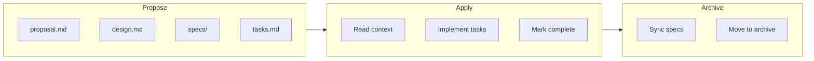

# OpenSpec и агенты в проекте products-table

## 1. Общая схема

Проект использует **OpenSpec** — spec-driven workflow для управления изменениями. Конфигурация в [openspec/config.yaml](../openspec/config.yaml):

- **Schema:** `spec-driven`
- **Context:** TECH_SPEC (Component-Driven Development, Feature-Driven Architecture, CSS modules, БЭМ, Radix UI, Tanstack Table и т.д.)

---

## 2. Команды и Skills

| Команда / Skill   | Назначение                                                                                                                |
| ----------------- | ------------------------------------------------------------------------------------------------------------------------- |
| **/opsx:propose** | Создать новый change: `openspec new change "<name>"`, затем генерировать proposal, design, specs, tasks в одном шаге      |
| **/opsx:apply**   | Реализовать задачи из tasks.md: читать context, выполнять задачи по порядку, отмечать `- [x]`                             |
| **/opsx:explore** | Режим обсуждения: без кода, только анализ, диаграммы, уточнение требований. Можно создавать артефакты OpenSpec по запросу |
| **/opsx:archive** | Архивировать change: проверить артефакты/задачи, синхронизировать delta specs, переместить в `archive/YYYY-MM-DD-<name>/` |

Файлы: [.cursor/commands/opsx-propose.md](../.cursor/commands/opsx-propose.md), [.cursor/commands/opsx-apply.md](../.cursor/commands/opsx-apply.md), [.cursor/commands/opsx-explore.md](../.cursor/commands/opsx-explore.md), [.cursor/commands/opsx-archive.md](../.cursor/commands/opsx-archive.md).

---

## 3. Артефакты (schema spec-driven)

| Артефакт                     | Описание                              |
| ---------------------------- | ------------------------------------- |
| **proposal.md**              | Зачем и что меняется                  |
| **design.md**                | Как реализовать                       |
| **specs/capability/spec.md** | Delta specs (требования к capability) |
| **tasks.md**                 | Чеклист задач (`- [ ]` / `- [x]`)     |

Структура: `openspec/changes/<name>/` — активные changes; `openspec/changes/archive/YYYY-MM-DD-<name>/` — архив.

---

## 4. Архивные changes (кейсы)

| Change               | Описание                                                                              |
| -------------------- | ------------------------------------------------------------------------------------- |
| **project-init**     | 2026-03-15. Инициализация Vite + React + TS, `package.json`, `npm run dev`            |
| **development-plan** | 2026-03-15. Создание `docs/DEV_PLAN.MD` — план разработки по TECH_SPEC                |
| **app-structure**    | 2026-03-15. Структура app/, api/, stores/, pages/, features/, components/, shared/    |
| **icon-component**   | 2026-03-15. Компонент Icon с 8 иконками (SearchIcon, ReloadIcon и др.), stories       |
| **button-component** | 2026-03-16. Button с вариантами (primary, secondary), размерами, иконками, Radix Slot |

---

## 5. Кейсы с промптами (из транскриптов)

### 5.1 OpenSpec-командыНайди используемые цвета добавить в переменные

| Промпт                                                   | Результат                                                                      |
| -------------------------------------------------------- | ------------------------------------------------------------------------------ |
| `/opsx:propose button-component`                         | Создан change с proposal, design, specs, tasks                                 |
| `/opsx:propose icon-component`                           | Артефакты по структуре Icons/, HideIcon вместо NoEyeIcon                       |
| `/opsx:propose api-client-set`                           | Change для API client                                                          |
| `/opsx:propose tanstack-query` + «Настроить API client»  | Change: apiFetch, QueryClientProvider, base URL                                |
| `/opsx:propose app-structure`                            | Change: app/, api/, stores/, pages/, features/, components/, shared/           |
| `/opsx:propose components` + изображения                 | basic-components-storybook: Button, Input, Checkbox, Modal, Toast, Table и др. |
| `/opsx:propose checkbox-component` + «1. создать новые цвета в переменных: unchecked-#B2B3B9, checked=#3C538E. 2. композитный Checkbox. 3. Состояние одно и размер один. 4. Будет использоваться в Table, фильтрах и формах. 5. Без CheckboxGroup. 6. С Accessibility» | Change: CSS-переменные, Checkbox (Radix), один вариант, использование в Table/фильтрах/формах, без группы, a11y |
| `/opsx:apply`                                            | Реализация задач из tasks.md (button, icon, app-structure, tanstack-query)     |
| `/opsx:explore button-component` + JSON Figma            | Разбор Figma-данных, сравнение с реализацией, предложение story Login          |
| `/opsx:explore button` + «Создать компонент в storybook» | Анализ: story-first vs component-first, порядок по DEV_PLAN                    |
| `/opsx:archive`                                          | Синхронизация specs, перемещение в archive/                                    |
| `/opsx:propose` + «1. ProductTable добавляет колонку с кастомным header cell, который рендерит Checkbox, а BaseTable только вызывает header.column.columnDef.header(). 2. Логика рендера ячеек определяется в column defs, а BaseTable только выполняет render через flexRender. 3. Состояние выбранных строк (selectedRowIds / rowSelection) передаётся в Root, а строки получают selected state через TanStack row API. 4. Для текстовых колонок применяется truncation по умолчанию с возможностью переопределения через настройки колонки. 5. Если у ячейки есть состояние, то им управляет родительский компонент. ProductTable рендерит кнопки + и ⋮ через custom cell и управляет состоянием. 6. Sort indicators рендерятся BaseTable, стрелки (↑↓) рядом с заголовком. 7. Используем семантичную таблицу. 8. При 0 строк — дефолтное значение в BaseTable, которое можно переопределить.» | Создан change с proposal, design, specs, tasks |

### 5.2 Explore: обсуждение и уточнение

| Промпт                                                                         | Результат                                                                 |
| ------------------------------------------------------------------------------ | ------------------------------------------------------------------------- |
| `/openspec-explore` + «создать компонент Icon» + список иконок                 | Карта иконок → использование, варианты (inline SVG, sprite, Unicode), API |
| «Это стандартные иконки? Можно ли их вставить с помощью Unicode?»              | Сравнение Unicode vs SVG, ограничения emoji, рекомендация SVG             |
| «как иконки масштабируются?»                                                   | Объяснение viewBox, width/height, 1em, currentColor                       |
| «Хорошо. Делаем Inline SVG. С доступностью. Сделай предложение icon-component» | Создание proposal с артефактами                                           |

### 5.3 Конфигурация и настройка OpenSpec

| Промпт                                                                  | Результат                                                                   |
| ----------------------------------------------------------------------- | --------------------------------------------------------------------------- |
| «как в open spec автоматически добавлять в контекст @docs/TECH_SPEC.MD» | config.yaml (context), Cursor rule, явные шаги в opsx-propose/apply/explore |

### 5.4 Прямые запросы (без OpenSpec)

| Промпт                                                                                   | Результат                                                             |
| ---------------------------------------------------------------------------------------- | --------------------------------------------------------------------- |
| «Найди используемые цвета добавить в переменные» + изображение                           | План: палитра в index.css, обновление Button.module.css, Icon.stories |
| «reset css и шрифты»                                                                     | План: CSS reset, Inter + Cairo, preconnect, Storybook preview         |
| «План: Добавление цветовых переменных. Implement the plan»                               | Реализация: index.css, Button.module.css, Icon.stories                |
| «Подгони размер button--lg под кнопку Войти»                                             | Обновление padding/font-size для button--lg                           |
| «Высотка кнопки должна быть 54px»                                                        | padding-y для точной высоты 54px                                      |
| «width: 147px; height: 42px; background: #242EDB... Первый вариант кнопки» + изображение | Button.tsx, PlusIcon, Button.module.css, story AddButton              |
| «Создай в папке Icons отдельные файлы для иконок»                                        | Рефакторинг: SearchIcon.tsx, ReloadIcon.tsx и др. в Icons/            |
| «@DEV_PLAN.MD dev-deps-install 0.2»                                                      | Storybook, ESLint, Prettier — установка и настройка                   |
| Ошибка EACCES порт 5173                                                                  | Смена порта на 5174 в vite.config.ts                                  |

### 5.5 Смешанные сценарии

| Промпт                                                                      | Результат                                                                           |
| --------------------------------------------------------------------------- | ----------------------------------------------------------------------------------- |
| `/opsx:explore button-component` + «добавить стори для кнопки» + JSON Figma | Анализ, уточнение — затем добавление story Login с кастомными стилями по Figma      |
| `/openspec-explore обновить button component spec`                          | Сравнение spec vs реализация, варианты обновления (минимальный/средний/расширенный) |
| «ок. Хорошо. Оставь как есть. отправь в архив»                              | Архивация button-component с синхронизацией specs                                   |
| «обновить текущий» (после explore «удалить ghost»)                          | Удаление ghost из Button, spec, design, proposal, tasks                             |

---

## 6. Интеграция с TECH_SPEC

- В [openspec/config.yaml](../openspec/config.yaml) задан `context` с TECH_SPEC
- Cursor rule `.cursor/rules/openspec-tech-spec.mdc` предписывает читать TECH_SPEC при работе с OpenSpec
- Артефакты (proposal, design, specs) ссылаются на DEV_PLAN и TECH_SPEC

---

## 7. Типичный цикл

1. **Propose** — пользователь описывает задачу или вызывает `/opsx:propose <name>`
2. **Apply** — `/opsx:apply` реализует задачи по tasks.md
3. **Explore** (опционально) — `/opsx:explore` для уточнения, сравнения Figma, рефакторинга (например, удаление ghost)
4. **Archive** — `/opsx:archive` после завершения и синхронизации specs

Часть задач выполняется без OpenSpec (например, CSS reset, цвета) — через обычные промпты или планы Cursor.